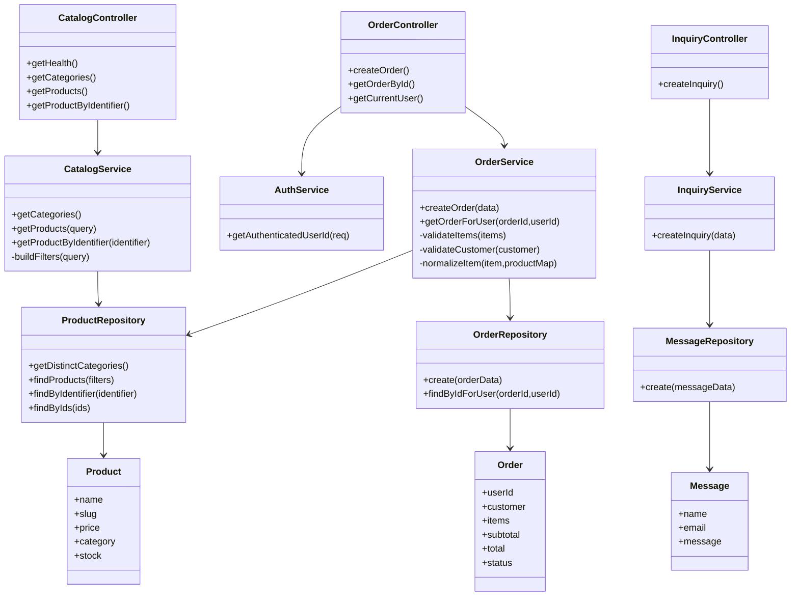

# Class Diagram

```mermaid
classDiagram
    class CatalogController {
        +getHealth()
        +getCategories()
        +getProducts()
        +getProductByIdentifier()
    }

    class OrderController {
        +createOrder()
        +getOrderById()
        +getCurrentUser()
    }

    class InquiryController {
        +createInquiry()
    }

    class CatalogService {
        +getCategories()
        +getProducts(query)
        +getProductByIdentifier(identifier)
        -buildFilters(query)
    }

    class OrderService {
        +createOrder(data)
        +getOrderForUser(orderId,userId)
        -validateItems(items)
        -validateCustomer(customer)
        -normalizeItem(item,productMap)
    }

    class InquiryService {
        +createInquiry(data)
    }

    class AuthService {
        +getAuthenticatedUserId(req)
    }

    class ProductRepository {
        +getDistinctCategories()
        +findProducts(filters)
        +findByIdentifier(identifier)
        +findByIds(ids)
    }

    class OrderRepository {
        +create(orderData)
        +findByIdForUser(orderId,userId)
    }

    class MessageRepository {
        +create(messageData)
    }

    class Product {
        +name
        +slug
        +price
        +category
        +stock
    }

    class Order {
        +userId
        +customer
        +items
        +subtotal
        +total
        +status
    }

    class Message {
        +name
        +email
        +message
    }

    CatalogController --> CatalogService
    OrderController --> OrderService
    OrderController --> AuthService
    InquiryController --> InquiryService

    CatalogService --> ProductRepository
    OrderService --> OrderRepository
    OrderService --> ProductRepository
    InquiryService --> MessageRepository

    ProductRepository --> Product
    OrderRepository --> Order
    MessageRepository --> Message
```
