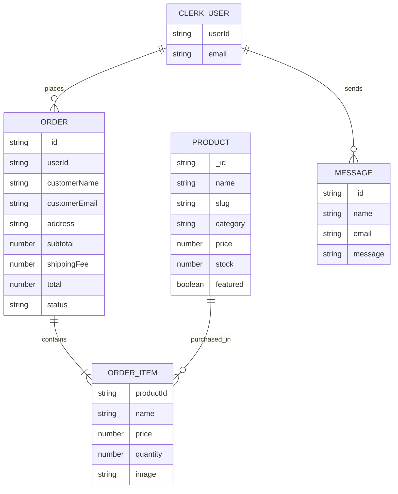

# ER Diagram

```mermaid
erDiagram
    CLERK_USER ||--o{ ORDER : places
    ORDER ||--|{ ORDER_ITEM : contains
    PRODUCT ||--o{ ORDER_ITEM : purchased_in
    CLERK_USER ||--o{ MESSAGE : sends

    CLERK_USER {
        string userId
        string email
    }

    PRODUCT {
        string _id
        string name
        string slug
        string category
        number price
        number stock
        boolean featured
    }

    ORDER {
        string _id
        string userId
        string customerName
        string customerEmail
        string address
        number subtotal
        number shippingFee
        number total
        string status
    }

    ORDER_ITEM {
        string productId
        string name
        number price
        number quantity
        string image
    }

    MESSAGE {
        string _id
        string name
        string email
        string message
    }
```
