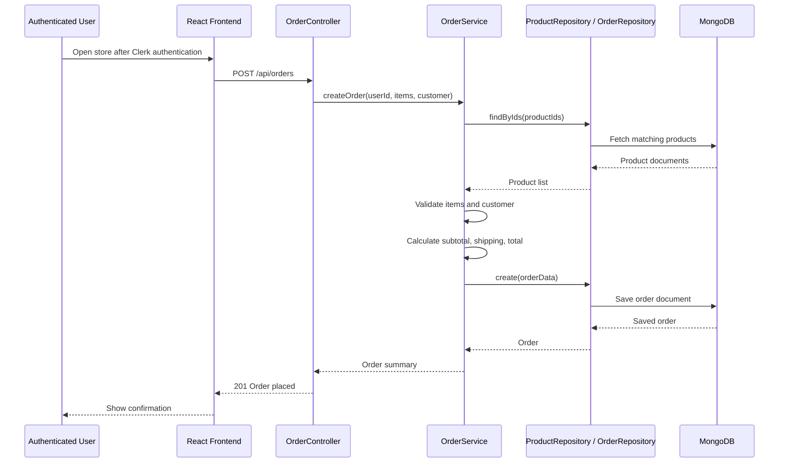

# Sequence Diagram

```mermaid
sequenceDiagram
    participant User as Authenticated User
    participant UI as React Frontend
    participant Controller as OrderController
    participant Service as OrderService
    participant Repo as ProductRepository / OrderRepository
    participant DB as MongoDB

    User->>UI: Open store after Clerk authentication
    UI->>Controller: POST /api/orders
    Controller->>Service: createOrder(userId, items, customer)
    Service->>Repo: findByIds(productIds)
    Repo->>DB: Fetch matching products
    DB-->>Repo: Product documents
    Repo-->>Service: Product list
    Service->>Service: Validate items and customer
    Service->>Service: Calculate subtotal, shipping, total
    Service->>Repo: create(orderData)
    Repo->>DB: Save order document
    DB-->>Repo: Saved order
    Repo-->>Service: Order
    Service-->>Controller: Order summary
    Controller-->>UI: 201 Order placed
    UI-->>User: Show confirmation
```
