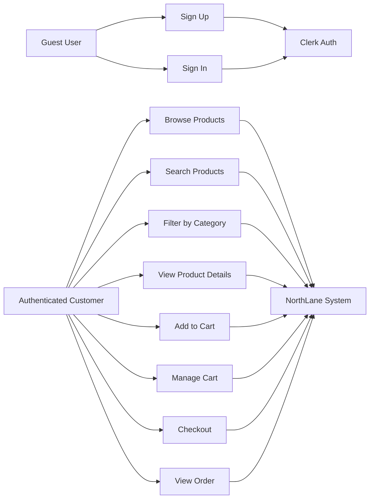

# Use Case Diagram

```mermaid
flowchart LR
    Guest["Guest User"]
    Customer["Authenticated Customer"]
    Clerk["Clerk Auth"]
    System["NorthLane System"]

    Guest --> UC1["Sign Up"]
    Guest --> UC2["Sign In"]
    UC1 --> Clerk
    UC2 --> Clerk

    Customer --> UC3["Browse Products"]
    Customer --> UC4["Search Products"]
    Customer --> UC5["Filter by Category"]
    Customer --> UC6["View Product Details"]
    Customer --> UC7["Add to Cart"]
    Customer --> UC8["Manage Cart"]
    Customer --> UC9["Checkout"]
    Customer --> UC10["View Order"]

    UC3 --> System
    UC4 --> System
    UC5 --> System
    UC6 --> System
    UC7 --> System
    UC8 --> System
    UC9 --> System
    UC10 --> System
```
